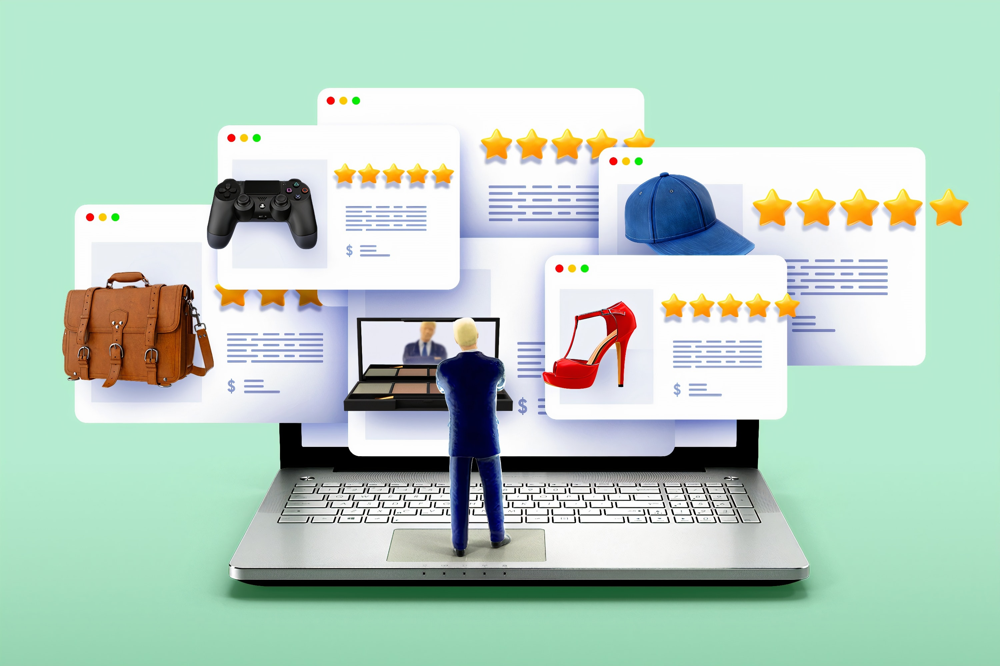

<!--StartFragment-->

É hora de fidelizar os clientes, mantendo uma comunicação aberta, direta e transparente!

Na nossa opinião, não há melhor ferramenta para fazer isso do que uma boa newsletter mensal. Nela podes partilhar as novidades do teu pequeno negócio, como por exemplo novas horas de funcionamento, férias, medidas de segurança, novos produtos ou serviços, etc...

Mas antes de pensares na estrutura e no próprio conteúdo em si, há uma série de dicas práticas que deves ter em conta na hora de montares uma boa newsletter e por isso resolvemos escrever um artigo com 10 dicas práticas que podes executar já ⬇️

\    **Dica 1** - o conteúdo da tua newsletter deve ser único e interessante. Como chegas a este ponto? Através de tentativa/erro. Não vais acertar à primeira, a não ser que sejas um profissional de marketing e, mesmo assim, nem sempre se alinha tudo à 1ª tentativa. Aquando a inscrição na newsletter, é importante que tenhas definido o que os clientes podem contar, ou seja, o foco da tua newsletter.

\    **Dica 2** - é importante que o conteúdo que partilhas na tua newsletter seja maioritariamente inspiracional/educacional e apenas uns 10% seja de venda. A maior parte dos clientes dá mais valor a novas dicas de como utilizar um produto, por exemplo, do que conhecer intensivamente todas as características do mesmo.

\    **Dica 3** - se usares plataformas como o Mailchimp, receberás algumas dicas enquanto montas a tua newsletter. Uma dica que achamos muito interessante é sobre os títulos curtos. Principalmente o título da tua newsletter em si, o que aparecerá no “assunto” do email. Curto e direto, com um emoji, e fica perfeito. O título da tua newsletter pode ir de encontro com a maior novidade que contas naquela edição (como o rebranding do website) ou então podes colocar um título engraçado que será sempre associado ao teu pequeno negócio. Por exemplo, a equipa do Menos sempre que trabalha numa newsletter escreve sempre como título “Mais do Menos” , um trocadilho bem interessante sobre as novidades do Menos Hub.

\    **Dica 4** - se a capacidade de design é algo que ainda precisas de aprender, escolhe um template simples e “limpo”. Por vezes, mais é menos. Principalmente quando não dominamos uma competência. Um design simples torna a newsletter muito mais fácil de ler e não quer dizer que não possas inserir as bonitas imagens que tiras dos teus produtos.

\    **Dica 5** - já mencionamos o uso de imagens anteriormente mas se não tiveres uma base de dados de imagens do teu pequeno negócio pronta a utilizar, podes sempre visitar plataformas como o “unsplash.com”, uma fonte de imagens gratuitas prontas para download. No entanto, aconselhamos sempre a que utilizes imagens dos teus produtos até porque o que queremos, no final de contas, é vender ao cliente.

\    **Dica 6** - não te esqueças de adicionar os links diretos para as tuas redes sociais e não há vergonha nenhuma em pedires para seguirem o teu pequeno negócio por lá! :) A newsletter é um canal de comunicação, tira partido dela!

\    **Dica 7** - atenção ao remetente da newsletter! Atualiza sempre esse email para o teu e-mail geral do negócio para que as respostas que recebas sejam direcionadas para aí.

\    **Dica 8** - uma dica super fácil: testa, testa, testa! Usa e abusa dos teus amigos e família enquanto montas a tua newsletter ideal.

\    **Dica 9** - avalia os números de cada edição. É importante perceberes se os teus clientes estão de facto a abrir a tua newsletter e a clicar nos links (mostra o interesse em cada tópico). É uma forma de também conseguires medir se vale a pena o esforço que investes nas newsletters. Para combater uma taxa de abertura baixa, podes mostrar um pouco do conteúdo que vais partilhar (estilo preview) nas redes sociais e, se os clientes quiserem saber mais sobre determinada informação, podem subscrever.

\    **Dica 10** - o processo de cancelamento da newsletter deve ser simples e explícito. Deve ser um processo de apenas 1 clique: carregar no “unsubscribe”. E lembra-te: lá por um cliente resolver sair da tua lista de contacto, não significa que não tenha interesse no teu negócio. Pode, por exemplo, não utilizar o e-mail diariamente e apenas querer conteúdos pessoais (ex: receber as contas do mês ou extratos bancários). Cada um usa as ferramentas online de diferentes formas e não precisas de ficar desanimado/a se isto te acontecer! :)

Acreditamos que estas dicas são um bom pontapé de saída para montares a tua newsletter e começares a testar com a tua comunidade! Não te esqueças: montar uma newsletter perfeita é quase impossível mas podes montar uma muito boa, que cative a tua audiência e que ajude nas tuas vendas. É um processo e não uma corrida, demora algum tempo até encontrares a tua “voz”. Não desistas até a encontrares!

Não te esqueças de partilhar connosco o teu resultado final :) Até lá, boas vendas!

<!--EndFragment-->