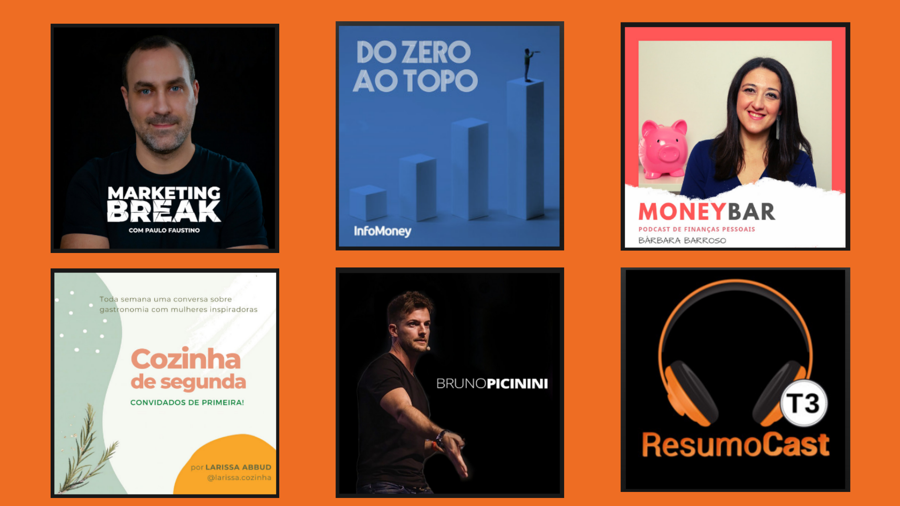

Os podcasts parece que vieram para ficar, e ainda bem! Dizemos nós e dizem os milhões de pessoas pelo mundo que diariamente os utilizam para se informar sobre o mundo, distrair, aprender, acalmar ou inspirar. Hoje em dia há podcasts sobre os mais variados temas e em diferentes línguas. E nós acreditamos que podem ser poderosas ferramentas para pequenos negócios e os empreendedores que lhes dão vida.

Desta forma, chegamos até ti com uma lista de podcasts que podes ouvir para te inspirares para o teu negócio ou aprenderes algo novo e útil. Pedimos à Frederica, da nossa equipa, para compor uma lista de podcasts que gosta e recomenda para todos aqueles que têm pequenos negócios. Segue a lista das suas sugestões:

**Em inglês**

*  <a href="https://open.spotify.com/show/39jI0ihm8h0RVvNhxa8jgM?si=Kc5nW28FSEufA2W1G7nOiQ" target="_blank">Social Media Marketing Podcast - </a>normalmente com temas úteis e abordagens facilmente praticáveis. Tem vários convidados, o que dá algum dinamismo. No entanto, o inglês é rápido e pode ser um obstáculo. 
* <a href="https://open.spotify.com/show/1NulSGKhstJuty8iYPBMo5?si=yyKql_3cRJ-9bIcbnhRPcA" target="_blank">Digital Marketing and Online Marketing Tips - </a>considerados gurus do marketing digital este podcast tem a vantagem de ter episódios curtos e muito práticos - embora possam ser bastante técnicos, principalmente no que toca a SEO. 
* <a href="https://open.spotify.com/show/3Olgk609RMiLHQWLoRulgX?si=bxCLDHhJSXyptFCWQimujA" target="_blank">Small Changes - </a>pessoalmente, é dos meus podcasts favoritos! Voltou agora para uma nova série, e ainda bem! São entrevistas e peças dedicadas a pessoas que, com pequenas soluções, dão resposta a grandes problemas mundiais. Gosto muito porque mostra o espírito empreendedor que pode surgir nas condições mais difíceis e são invariavelmente pessoas que ultrapassam vários obstáculos. 
* <a href="https://open.spotify.com/show/2plrTOwxJgKi8Fb23jeKOy?si=d1vHgYWBSA2hbfnlEJzN1Q" target="_blank">Courier Workshop - </a>tem poucos episódios mas é algo a prestar atenção. A Courier é uma revista focada em pequenos negócios modernos e o seu foco é muito semelhante ao #compraaospequenos. 
* <a href="https://open.spotify.com/show/6DWKdS4aRX0aqztXUkVnnf?si=V_6E_7R-TmeyRTs8xzc6yQ" target="_blank">Duct Tape Marketing - </a>focado em dicas de marketing para pequenos negócios. Tem um formato interessante e os temas são relevantes. 
* <a href="https://open.spotify.com/show/1VXcH8QHkjRcTCEd88U3ti?si=vIURKbvuSqG6_BR9VgnDpg" target="_blank">TED Talks Daily - </a>inspiração e informação para a vida. Imperdível!

**Em português** 

* <a href="https://open.spotify.com/show/074lGSlRZDdsze8L8AsLIm?si=Xa9OAgzIRxmNdgGmID717A" target="_blank">Cozinha de Segunda -</a> É focado cozinha e gastronomia, as convidadas são mulheres de diferentes geografias e...são empreendedoras, com histórias e aprendizagens de diferentes áreas. 
* <a href="https://open.spotify.com/show/63Dn3uvTTIKKxJOLUrkyAn?si=bT54WUxQTdmPrueXqCRJGA" target="_blank">ResumoCast -</a> resumo de livros relevantes, de empreendedorismo, gestão, etc. Há alguns episódios bastante interessantes e que valem bem a pena ouvir! 
* <a href="https://open.spotify.com/show/2yu1AssTJSODuex4tcbQxS?si=C_F4sxUDQhW2WvazJZU-ig" target="_blank">Marketing Break com Paulo Faustino - </a>se estão em Portugal e já procuraram ajuda sobre marketing digital, o mais provável é já terem ouvido falar do Paulo Faustino! Conteúdo muito acertado e os episódios são *on-point* e não demasiado grandes.
* <a href="https://open.spotify.com/show/7sA5K4l66tkUaUJ8WmpvyJ?si=V-3m2LZETw-kt8t9ahRqxw" target="_blank">MoneyBar - </a>sobre finanças pessoais, não é directamente relacionado com empreendedorismo mas, o bom empreendedor tem que saber gerir finanças, a começar pelas suas! 
* <a href="https://open.spotify.com/show/48ljM9qIbODhemJ7lLGjeR?si=nTuKSV9DSJK4zRQ3GdOcpQ" target="_blank">Do Zero ao Topo - </a>histórias de empreendedores que começaram grandes negócios, principalmente no Brasil - para aprender com quem criou grandes empresas. 
* <a href="https://open.spotify.com/show/2ygnNeqEb0gbz1jfIggKh6?si=vLCz9TixR2qoeuId5ze9Ig" target="_blank">Bruno Picinini Podcast - </a>gostei bastante deste podcast por ter episódios práticos de marketing ao mesmo tempo que tem outros sobre criação de negócios! 

São várias sugestões que te poderão ser úteis em diferentes alturas. Poderás ser fã de alguns e não perder um episódio, ou procurar na lista e encontrar os episódios que te possam ser mais úteis a cada momento. O importante é que te lembres que os podcasts podem ser também um óptimo recurso de inspiração, força e aprendizagem.