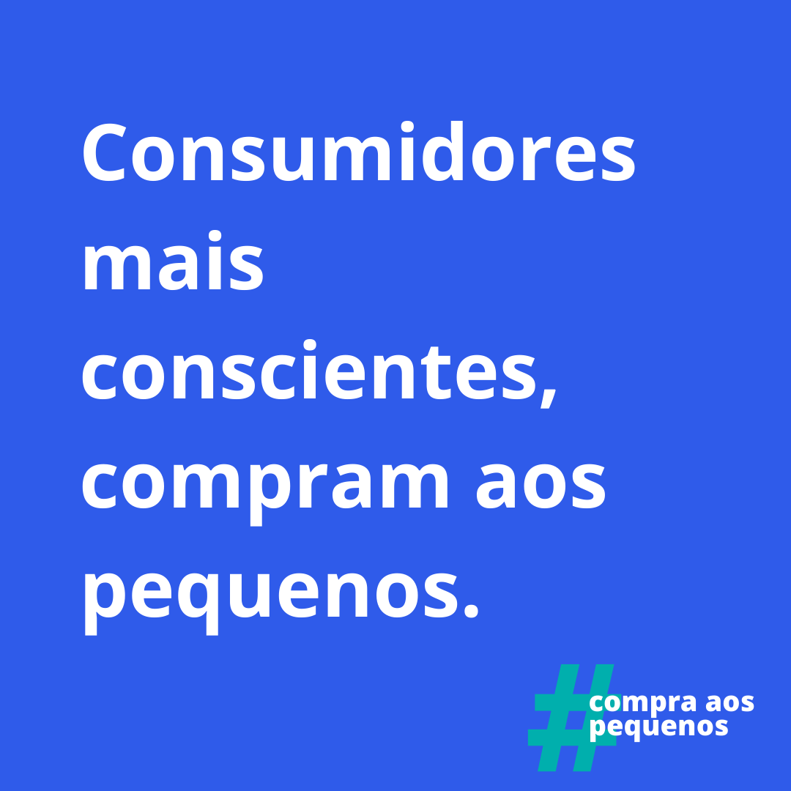
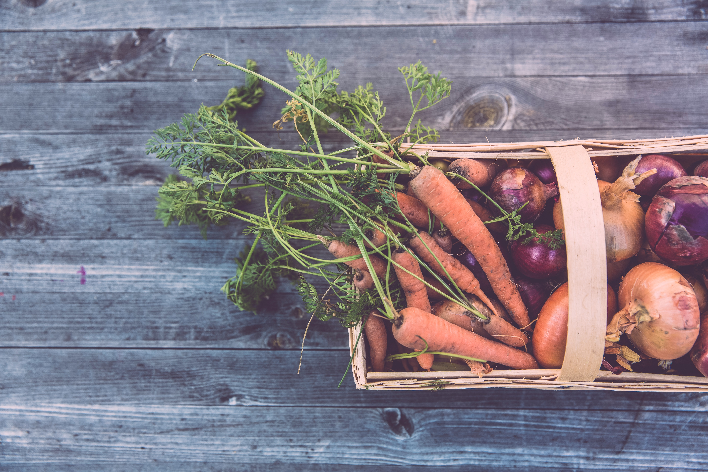

Já parou para analisar quais são os seus hábitos de consumo? Quais são os critérios que usa normalmente na hora de comprar?  Se não sabe responder a nenhuma destas questões, é porque talvez não esteja ciente, ou então não têm hábitos de consumo consciente. Contudo, as mudanças que já começam a acontecer na sociedade direcionam para um consumo mais consciente, à medida que as pessoas reavaliam o impacto das suas ações de consumo. É urgente uma mudança de mentalidade, principalmente no que toca aos pequenos negócios, é necessário criar hábitos conscientes que agreguem valor e sejam geradores de mudanças positivas para a sociedade e o consumo consciente é sem dúvida uma delas. Os pequenos negócios são o combustível de toda a economia, por isso, é fundamental estimular o seu desenvolvimento. E hoje mais do que nunca é exigida união e apoio dos consumidores para adquirem serviços e produtos das pequenas empresas. Veja como pode mudar os seus hábitos e comece já hoje a ser um consumidor consciente.  

### **O que é consumo consciente** 

Consumo consciente é um movimento social que se baseia no aumento da consciencialização sobre o impacto das decisões de compra no meio ambiente, na saúde e na vida dos consumidores em geral. Consumir de forma consciente significa decidir cuidadosamente e com atenção os bens que vão ser adquiridos na vida quotidiana. Assim como, ser racional e ter noção do impacto gerado por determinado produto/serviço.

O consumo consciente não defende apenas comprar somente o necessário, mas também escolher com cuidado o que se adquire e perceber se é benéfico para o meio ambiente e para a sustentabilidade da sociedade. Uma atitude consciente, é por exemplo evitar o desperdício de água, luz ou não comprar produtos descartáveis devido às suas consequências para o meio ambiente. Pode-se dizer que é um estilo de vida e sob a perspetiva ecológica, é aquele que se preocupa como seu bem-estar, com a sociedade atual e com a qualidade de vida das gerações futuras, contribuindo para a melhoria da qualidade de vida de todos.

### **Consumidor consciente**

Por seu lado, o consumidor consciente é alguém que olha além do rótulo, é um agente de mudança que considera o impacto social, ambiental, ecológico e político das suas compras e ações. Ele envolve-se na economia com mais consciência e preocupa-se com a forma que o seu consumo afeto a sociedade em geral. Trata-se de manter a mente envolvida e garantir que se entende exatamente o que se escolhe apoiar ou não.

Embora pareça bastante simples, fazer esse “exercício” antes de comprar de um determinado produto/ serviço nem sempre é tão fácil quanto deveria ser, e é preciso esforço para fazê-lo da forma certa. Então, porque é tão importante?

### **Porque devemos tornar-nos consumidores conscientes e priorizar as pequenas empresas?**

Pode parecer um esforço extra e simplesmente, sem pensar muito, a tendência é comprar à marca mais barata ou então às grandes superfícies comerciais. Então, porque devemos mudar a forma como apoiamos o nosso consumo?

###### ***Facilmente disponível*** 

Estamos a falar do mercado do seu bairro, da padaria da esquina, da esteticista, do sapateiro e de uma infinidade de outros produtos/serviços perto de casa. É comum ter tudo isso ao nosso alcance e nem percebemos que essas pequenas empresas estão sempre “ao nosso lado” seja fisicamente ou online.

###### *Familiaridade*

Nos pequenos negócios muitas vezes existe a possibilidade de conhecer a pessoa que está do outro lado e vice-versa. O comerciante irá chamá-lo pelo seu nome e irá conhecer os seus gostos. 

###### *Personalizado e de qualidade*

Em vez de se focar na produção em massa, o pequeno negócio vai se esforçar em oferecer produtos de qualidade a um preço justo. O mesmo acontece com os serviços que começam a ser mais direcionados para as suas reais necessidades, de acordo com o precisa. Criação de mais postos de trabalho Em Portugal, 99,9% do total de empresas são pequenas e médias empresas. Elas são geradoras de muitos empregos e o sustento de várias famílias portuguesas. Ao comprar aos pequenos não está apenas a ajudar a empresa, mas todas as famílias que lá trabalham. 

###### *Desenvolvimento da comunidade*

Pequenas empresas atraem movimento local e promovem o desenvolvimento cultural e social, isso estimula as empresas a melhorar e inovar diariamente, assim como diversificar mais a oferta de produtos/serviços e aprimorar o atendimento ao cliente. 

###### *Comprar o que é nosso*

Uma vez que tem poder de escolha na compra, ao escolher o pequeno negócio ajuda a fortalecer o segmento para além de impulsionar a economia. Essa decisão é um ato que poderá transformar o país, pois todos ficam a ganhar, desde o pequeno negócio, o consumidor, os cidadãos portugueses e Portugal. 

### Consumo consciente e a responsabilidade das empresas 

As empresas exploraram os recursos humanos e naturais por muito tempo sem se preocuparem com a sua escassez. isso gerou uma quebra na confiança na sociedade. Contudo, o aumento da consciência social e ambiental nos últimos anos têm vindo a elevar a pressão sobre as empresas, para que reduzam o impacto das alterações climáticas e do desperdício.  

Se tem uma empresa, queremos explicar-lhe como deve olhar encarar o consumo consciente e porque isso é importante para o seu negócio. As vertentes do consumo consciente por parte das empresas podem ser de três naturezas: Quantitativa, Ambiental e Tecnológica. Na vertente qualitativa, o objetivo é promover ações que buscam reduzir o volume do consumo. Isso é possível, através da consciencialização do público interno e programas de formação para tratamento, reutilização, consumo, reciclagem e correta destinação dos resíduos de águas, energia e insumos em geral.  Na vertente Ambiental o objetivo é estabelecer ações e consciências que priorizem o consumo e uso de produtos que tenham origem em processos produtivos sustentáveis e de fontes renováveis. Sejam matérias primas, máquinas e a utilização dos recursos em si.  A terceira vertente é a Tecnológica, no sentido de transformar os processos produtivos em algo menos impactante e mais económico, assim como, substituir energias por outras mais sustentáveis. 

Muitas empresas ainda têm dificuldades em medir o impacto financeiro gerado pelas estratégias de sustentabilidade e que é, essencialmente, mensurável através da satisfação/experiência do cliente. Por outro lado, os consumidores esperam marcas mais sustentáveis e embora o preço tenha muita influência na decisão de compra, cada vez mais compram determinado produto devido à embalagem reutilizável ou biodegradável, assim como, preferem serviços de origem sustentável.

### Dicas direcionadas para o consumo consciente e a pequenos negócios

* Faça lista de compras e planeie. Isso leva-o a comprar somente o que precisa, comida, roupa, produtos, entre outros;
* Se, ao procurar mudar os seus hábitos, não souber como encontrar pequenos negócios que respondam às suas necessidades, procure nos diretórios como o “[Compra aos Pequenos](https://compraaospequenos.pt/shops/)”;
* Se fizer as suas compras ou encomendas online, não se esqueça que muitos pequenos negócios já fazem vendas digitalmente (através de site ou redes sociais) e procure comprar-lhes diretamente em vez de utilizar grandes agregadores como a Amazon ou Dott.pt;
* Guarde os contactos/referências de pequenos negócios que lhe interessam para, quando necessitar de fazer uma compra, poder encontrá-los facilmente;
* Adote o lema "comprar melhor é comprar menos".  Isto implica a análise do preço, da origem e processo dos produtos, não se deixe influenciar apenas pela marca;
* Vai de férias, escolha ficar em hotéis/casa ecológicas e sustentáveis ou que sejam geridos por pequenos negócios;
* Reduza! Leve os seus sacos das compras de casa e diga não aos plásticos, opte por produtos com menos embalagem.
* Avalie os impactos do seu consumo;
* Consuma apenas o necessário;
* Reutilize e recicle;
* Conheça as práticas de responsabilidade das empresas;
* Não compre produtos pirateados;
* Entre muitos outros; o importante é ir se adaptando gradualmente, de acordo com as suas possibilidades.

Para terminar, podemos dizer que o consumo consciente é um estilo de vida voluntário, quotidiano e solidário que procura garantir a sustentabilidade da vida de forma equilibrada. Por isso, no [Menos](https://menoshub.com/) o nosso trabalho com micro e pequenos negócios desperta a urgência de apelar ao consumo consciente, pois acreditamos que hábitos de consumo mais conscientes irão refletir-se no sucesso de muitos micro e pequenos negócios. Muitas vezes a reflexão com os empreendedores passa por "como sensibilizar as pessoas que determinado produto ou serviço é importante para a sua vida", por exemplo, que a prática de técnicas de ginástica mental, como ensina a [AtivarMentes](https://ativarmentes.pt/), é tão ou mais importante para o envelhecimento precoce como soluções promovidas em revistas de grande tiragem. 

Percebemos que há muitos negócios de nicho a resolverem problemas reais e importantes das quais as pessoas nem se apercebem. Por isso, lançámos o [\#Compra aos Pequenos](https://compraaospequenos.pt/), é incrível a quantidade de empreendedores criativos e lutadores que, todos os dias procuram fazer a diferença e entregar o melhor para os seus clientes. Por outro lado, durante a quarentena, fomos testemunhas de recorrentes conversas onde as pessoas, se sentiam perdidas por não poderem ir a centros comerciais fazer as suas compras, ou com as longas esperas de entregas dos hipermercados. Tudo isto, já com as lojas dos pequenos a adaptarem-se tão rapidamente para a venda digital, com os produtores e merceeiros a fazerem entregas diretamente em casa dos clientes. 

Sabemos que comprar aos pequenos pode ser mais complexo, moroso e muitas vezes dispendioso. Mas o consumo cada vez mais consciente é uma necessidade, pela saúde da nossa economia e do planeta. 

Todos juntos podemos fazer realmente a diferença.

