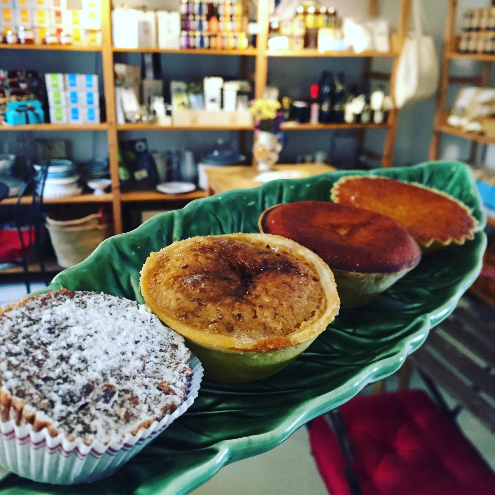
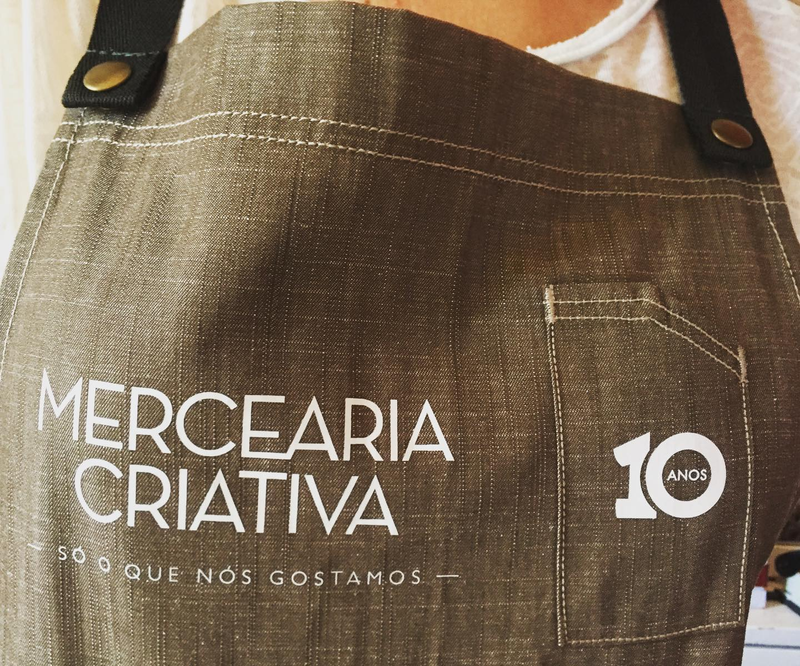

O movimento #compraaospequenos surgiu por força das circunstâncias especiais do confinamento Covid-19 como uma forma dos pequenos negócios chegarem aos consumidores através de uma plataforma que divulga a sua oferta actual e mostra a sua capacidade de se reinventarem. 

As grandes mudanças trazem oportunidades únicas pelo seu carácter disruptivo e é por isso que no #compraaospequenos procuramos todos os dias soluções para alavancar a economia dos pequenos e microempreendedores.

*Numa iniciativa única e com o objectivo de construir uma comunidade*, conseguimos apresentar os produtos dos pequenos negócios da nossa comunidade a fantásticos retalhistas com o objectivo de comercializarem esses produtos nos espaços onde operam. Produtos locais, distintos e com carácter pessoal.

**Hoje, a Mercearia Criativa é pioneira desta nova iniciativa #compraaospequenos** e terá disponível para venda alguns dos maravilhosos produtos produzidos pelos pequenos negócios da nossa plataforma.

Com dez anos de existência, a Mercearia Criativa nasceu com a vontade de recuperar a tradição de negócio de bairro com um “tratamento personalizado e próximo mas adaptado a uma nova realidade da comunicação e do gosto por produtos naturais, biológicos e orgânicos” e onde também se servem refeições. 

#### Aderiram ao #compraaospequenos pela identificação imediata com o movimento.

Desde o primeiro dia vendem produtos dos pequenos produtores nacionais porque acreditam na qualidade e na capacidade de incentivar a economia nacional, recuperando o espírito de comércio de rua.

Têm orgulho em afirmar que muitos pequenos negócios crescem pelo impulso e carinho com que são promovidos na Mercearia Criativa, “faz parte do ADN”.

Para a Mercearia Criativa, estas parcerias fortes e assentes na confiança e na cumplicidade são o cerne do negócio. 

Apostam na simplicidade, na comunidade e só vendem produtos que realmente gostam e acreditam. Esta é a sua forma de valorizarem a comunidade envolvente e de fazer com que os seus clientes tenham acesso a produtos inovadores e de qualidade superior.

> *“Temos de sentir algo, envolvermo-nos. Para nós é essencial que os nossos clientes sintam confiança em nós, nos nossos produtos e nas nossas sugestões. Por isso, visitem-nos, descubram-nos. ”* 

\
A <a href="http://www.merceariacriativa.com/" target="_blank">**Mercearia Criativa**</a> #compraaospequenos.  Visite! Morada: Av. Guerra Junqueiro 4A, 1000-167 Lisboa
Horário de funcionamento: 2ª e 3ª feira, das 11h às 20h.

#### Quer fazer parte desta iniciativa?

No #compraaospequenos acreditamos que a pequena economia de amanhã depende de todos nós, hoje.

Tem um espaço comercial, uma loja ou uma mercearia? Gostaria de atrair potenciais novos clientes enquanto apoia a sobrevivência de pequenas empresas locais? 

Contacte-nos e fique a par de todas as nossas iniciativas!